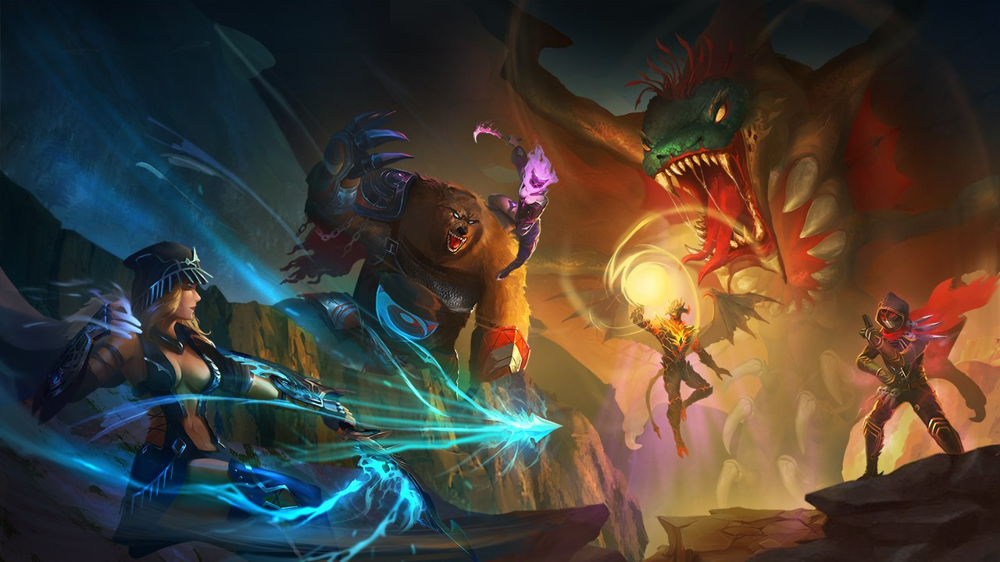

# 📜 2. The history of the FOTA Universe

Billions of years ago, the vast expanse of space was covered with a coldest, darkest blackness. Suddenly, there appeared a glimmering singularity where space and time were bent infinitely. The great super-energy that existed within the core of the Aether nucleus - the ultimate energy source of the universe - dragged, devoured, and crushed all nearby matter.

In the early days, the universe was an infinite space covered with darkness, there was an evil entity called the Darkness. And then one day, the most destructive explosion ever happened, bending all space-time, tearing the silence apart, pushing back the dark and ushering in an era of mysterious chaos.

In the end, what comes will come. The singularity roared and twisted in a fury, along with roars and terrible screams. After that, the greatest disaster ever happened, it tore everything apart and exploded with a bang - ushering in an era of mysterious chaos.

The energy from that explosion reshaped the universe and gave birth to two opposite realms - The Physical and the Spiritual Realm. Those two realms coexisted like two sides of the same coin, bringing the universe back into balance. From here, there were contrary concepts giving explanations for the dawn of all creation: the light and the dark, life and death... The explosion was later called the Big Bang, Aether - or "Creator" - was the name given to the energy source it generated. The reason for the name "Creator" was that Aether sent energy throughout the universe to urge on the advancement of all creatures, allowing life to flourish wherever it reaches. In the Spiritual Realm, the first rays of light in the explosion were shaped and linked together to form a beautiful land known as "The Greenland - The Land of Eternity".

The Big Bang marked the end of the singularity. Still, its soul persisted as the Creator, ruling over the Aether - where hides all the biggest secrets, even the power to teleport to those entities that were once parts of the dead singularity.&#x20;

Debris carrying different dimensions of space-time drifted everywhere. They possessed supernatural powers as a privileged gift from the Creator, forming parallel universes. It’s maybe the end of this story and the beginning of another one, at the same time, arisen from the remains of the explosion are living beings, they flourish and rule the universe.

The pure energy of Aether slowly turned into the soul, and thus the first living things - The Omni - were born. For being closest to the Aether, the Omni possess supernatural power and the Eye that can see things, create space. Besides the powerful Omni, there is also the Dragon - mysterious and long-lived creatures which were born from the primordial light. All have made the Greenland extremely flourishing and they are all aware of their race's great responsibility in protecting, maintaining, and developing the universe's balance. Thus, many Omnis have used their power to open Space Bridge in search of new lands, track and guide native races to use Aether's energy to push the advancement of their worlds. Therefore, the Omni are worshiped as the gods of the big universe. However, the Omni realized that due to the boundary between the two realms, they could not communicate directly with other races in the Physical Realm. Beings on the Physical Realm, on the other hand, did not know how to unlock the hidden spiritual power within their bodies, so these creatures are far inferior to those of the Greenland - Omnis and Dragons. As a result, the Omni have found many ways, trying to communicate with the Physical Realm but all are very limited.

**“THE GREENLAND - The Land of Eternity”** is the origin of the Aether. When the stellar lights were released after the explosion, they moved in the same direction and linked together as fated into a green universe called “The Greenland”, possessing the most beautiful colors and adorned with shining light setting such a scene known as the heaven of all space-time.

As opposed to the Greenland of Spiritual Realm, the Physical Realm is consistent with the laws of nature, with the physical body. The Aether energy in each being is very little and not everyone can feel it, except for magicians, no one else has this kind of power. These magicians are born with the Eye, which allows them to sense and use the power from Aether, they come from many races but mostly the Human on the Earth - the dominant beings in the Physical Realm. Those magicians gathered together and built The Sun Temple to train and control the power of Aether, they called it magic and let other inferior creatures take advantage of it with complex spells. Passing through many hardships, only the most powerful magicians could interact with the Omni and usher in a new era for the Human and the Physical Realm.

"The Omni" is the first race created in the universe. Having received Aether's favor, The Omni has great inner strength and energy. They do hold a heavy responsibility. The Creator has made his decision, entrusted them to protect the Aether and usher the whole universe into a new era of peace. Thus, many Omnis have used their powers to open Space Bridge in search of new lands, track and guide native races to use Aether's energy to push the advancement of their lands. Therefore, The Omni is worshipped as the gods of the universe.

In order to maintain the universe’s balance and prove their role, the Omni began to teach the Human to utilize the power of Aether and unlock their hidden power. The first human magicians, led by The Omni, evolved to a higher level and became The Elf - lived under the guard of the Omni, they worshiped and lived their lives in the manner of the Omni. From here, the Earth flourished and became the greatest Middle-Earth that history has ever recorded, thanks to the Great Magic at the Sun Temple.

"The Dragon" are mysterious creatures with enormous wings that often hover over THE GREENLAND. Taking advantage of The Dragon's extraordinary power and ferocity, the Omnis actively organized an alliance, and at the same time, added to the fast-paced energy obtained from the Aether, increasing The Dragons' movement speed along with ferocious battle fervor. They have become guardians protecting THE GREENLAND from the dark forces of THE NIGHTMARE.

**"THE EARTH - The Superior Civilization"** was created from the remnants of the Big Bang, from the most primitive, pure, and hard-to-melt matter, under the unparalleled gravity of the universe. They were fused to form a planet covered with a sturdy lithosphere, the only place where a biosphere exists that emits warm light or rains that create a harmonious hydrosphere.

The interaction between the two realms appeared to be a beautiful dream bringing prosperity and balance to this universe from now on, no one knew it was just the calm before the storm. At that time, the Silver Serpent - the most powerful king of the Earth, with ambitions to rule the realms, had given the order to carry out horrific experiments on the human body to explore the Aether and master its power. Then, he realized that the Aether energy would strengthen their natures, skills and make them stronger than ever, the more energy they absorbed, the stronger they became. Those who were stripped of their Aether would soon become mindless zombies who just took orders from others. This incident led to chaos on the Earth and war broke out between two sides - One side were the Elves and magicians fighting against the brutal evil, while the other side were the cruel king and the fallen magicians - who wanted to use Dark Magic and search for ruins of the Darkness.

Besides the never-ending war against evil, there was a group believing that magic would bring disasters to all living creatures and finding ways to eliminate it out of this universe. This group was called the Keen, they developed a wide range of advanced machines with destructive power as terrifying as magic and were willing to kill anyone possessing magic as a way to save their universe. That just made everything go from bad to worse - there were more wars and wars lasting for centuries and leading to long-standing feuds among many sides.

"The Human" is the creature who make up the majority of The Earth. They have ruled The Earth with their brightest minds and high social behaviours, making this place more and more prosperous by utilizing its resources as a privilege from Mother Nature. Meanwhile, the favourable weather here gradually shaped mountains and oceans that joined together to turn The Earth into a wonderful world. But, that is not enough, they keep on wanting more, more and more. They strongly believe that the Aether is the only way to lead them to the top of supreme domination.

With the chaos on the Earth, there was a conflict in the world of the Omni. One side tried to protect the Earth beings as well as find ways to solve everything peacefully, the other side said that the Earth had gradually corrupted and needed to be eliminated to bring back the balance for other worlds. The conflict occurred, those disgruntled shaped the course of history by destroying the Earth alone. Then, right on the Greenland, a battle took place between the Omnis, without the support of the Dragons, the group of disgruntled Omnis was quickly defeated, stripped of their power and banished from their homeland forever. After this failure, those Omnis became more and more negative and they were devoured by envy and hatred towards the Greenland, they believed that their race, the Omni, were the most powerful beings in the universe to conquer all life.

"The Elf" a supernatural elven race that appeared in the early days under the protection of The Omni - the masters of the sky. Therefore, they received profound knowledge that few creatures know about this mysterious universe. Although they are only a small race, with a lifestyle hidden in nature, they have been favored by the Creator with a unique ability from the Aether that allows them to use Energy (Mana) in an incredibly skillful way to survive and fight against the powerful forces of the enemy, especially The Human - the race that wants to enslave them.

After being exiled, they wandered around the realms and then arrived at the deepest part of the whole universe - The Nightmare - where the light could not reach and everything here was all in utter darkness, this was also where the evil entity the Darkness resided after the Big Bang. Those lost Omnis soon absorbed the dark power here and slowly turned into a new race called the Demon. They named themselves Lords from Hell, accompanied with the dark creatures born of fire and dust of the Darkness - The Beast, with its bloodthirsty nature, the Beast quickly became ruthless killing machines, the right hand of the Demon. Now, the Demons are just waiting for the chance to avenge their old feud with The Omni and begin their quest to rule all realms.

"The Keen" is a race of mechanical constructs. They are also known as alchemists, as they possess the energy to transform minerals and materials - the most basic of the universe - to create destructive weapons or potions that heal any damage. As a result, The Keen is often found in lands with powerfully concentrated energy and the most extreme areas on The Earth. As a perfect complement to their combat ability, the Human race trades with the Keen to acquire this unique transformation technology.

Without a shadow of dark, the real Omnis has learnt of the existence of Demons and Beasts, they offered alliances to not only the Dragon but also the Elf and Magicians on the Earth, ready for the next fight of the age.

Picturing the exact opposite of The Greenland is **“THE NIGHTMARE - The Darkest Nights”**. This forbidden area is cursed with mysterious black magic. The ground is riddled with fire, dust and ashes. Up in the sky are gray clouds, lightning storms and roaring winds, which together tear the dark sky apart and destroy anything close to it. All of these turned The Nightmare into a living hell.

The Demons were not less than that, they came to the Earth, bestowed dark power from the Darkness as well as conciliated the fallen magicians to their side, turned them into an army known as the Orge. Unlike the Elf, the Ogre gradually became an obsession for all creatures on the Earth. They kept gathering more heretics and performing ritual sacrifices in order to summon thousands of fearsome monsters to devour the Human. This moment glorified the horrors of the worst war in universe history, known as the Dark Moon War, every creature rushed to war for one, singular purpose: to be the last one to survive and claim the Aether for themselves. A new era is about to dawn!

"The Demon" is a race of dark creatures rumored to be descendants of Omnis who were corrupted during the exploration of the land of The Nightmare. Legend has it that, in the darkest and coldest places on The Nightmare, the vanguard Omnis lost their ability to use the power of the Aether. Instead, mysterious and dark energy poured into their bodies. Upon returning to The Greenland, the magically infected Omnis gradually became a dark force that wanted to take over the Aether to rule the world. From there, a civil war between the Omnis broke out. The evil Omnis were defeated, and black magic brought them back to The Nightmare to reconstitute their strength and power, waiting for the right time to return for revenge and take the Aether.

"The Beast" is indigenous to The Nightmare. They are wild creatures with outstanding endurance that live in harsh terrains. The dark magic in their bodies became so fierce and aggressive that no one could control that brutality. However, the Beasts can only use black magic to enhance their strength. As a result, they are considered brutish but stupid.

Bearing their purposes when living and ruling the universe, the races are aware of the existence and privilege of the "Aether." They plunge into fierce conflicts, and even wars are fought in this space-time illusory universe. They have sworn to possess this supreme energy to serve their own purposes at all costs. It was at this moment that a new era opened up, an era of never-ending battles.
