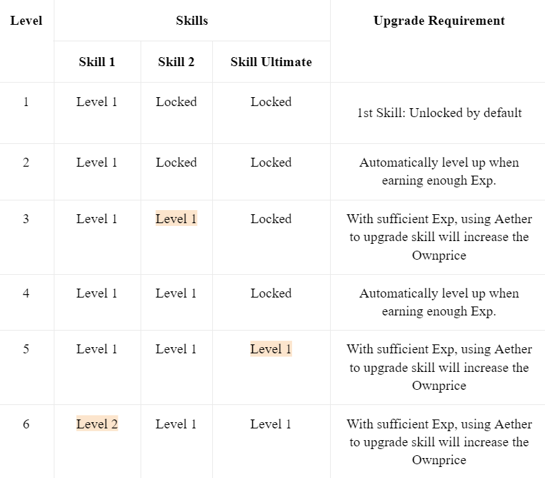
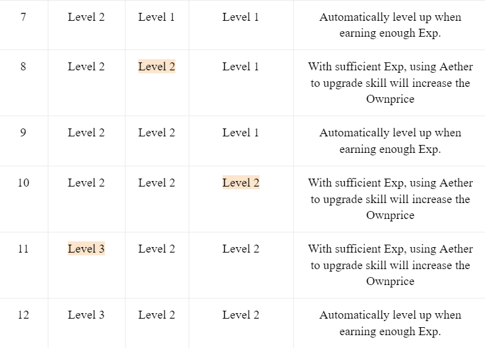
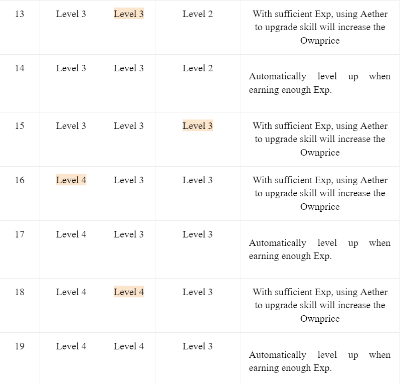

# 🎮 8. Gameplay & Policy

### ♦️ <mark style="background-color:purple;">**Ownprice & Total Profit**</mark>&#x20;

Each Hero NFT has 2 indicators, Ownprice & Total Profit&#x20;

#### Ownprice:&#x20;

Ownprice is the total cost of minting 1 NFT when users purchase directly from FOTA Development Team on FOTA Marketplace. Upgrading Heroes' Skills with Aether will increases Ownprice.&#x20;

Each Hero NFT has 2 Ownprice values:&#x20;

* USDF Ownprice is the fixed price of Heroes officially launched at level 1 and will increase after each time leveling up the skills with Aether. Consuming 1 Aether adds 5 USDF to the USDF Ownprice (1 Aether = 5 USDF)&#x20;
* FOTA Ownprice is determined according to the time users purchasing their level 1 Heroes:&#x20;
* For NFTs minted before July 5th, 2022; FOTA Ownprice is USDF Ownprice /0.17&#x20;
* For NFTs minted after July 5th, 2022, FOTA Ownprice is USDF Ownprice divided by the highest price within 12 hours when the NFTs are minted.&#x20;

Hero USDF Ownprice is as follows&#x20;

|      Name     |     Price    |
| :-----------: | :----------: |
|    **Eira**   | **190 USDF** |
|   **Aedus**   | **190 USDF** |
|  **Malhela**  | **200 USDF** |
|   **Keisha**  | **180 USDF** |
|   **Cyril**   | **180 USDF** |
|   **Ciara**   | **180 USDF** |
|   **Grimm**   | **190 USDF** |
|   **Orson**   | **170 USDF** |
|    **Zel**    | **180 USDF** |
|   **Aprum**   | **170 USDF** |
|  **Octonus**  | **180 USDF** |
| **Amaltheus** | **180 USDF** |
|   **Tigris**  | **170 USDF** |
|   **Farrer**  | **190 USDF** |
|   **Kekor**   | **170 USDF** |
|    **Alva**   | **200 USDF** |
|    **Kyla**   | **200 USDF** |
|   **Gideon**  | **200 USDF** |
|    **Eryk**   | **190 USDF** |

Note: Ownprice of 1 Hero NFT remains unchanged when buying or renting Heroes from other users&#x20;

#### Total Profit: <mark style="color:blue;"></mark>&#x20;

The profit of 1 Hero NFT is calculated when:&#x20;

* Hero participates in PVE Missions (Campaign Mode, Worldmap Missions)&#x20;
* Players win the Missions and confirm transactions on Metamask.&#x20;
* Game reward transactions are executed successfully on Smart Contract.&#x20;

The currency of Mission Reward is USDF, which will be calculated as FOTA Reward according to its highest price within 12 hours when passing a level.&#x20;

Mission Rewards, after deducting gas fees, will be divided into 3 and added to the Total Profit index of 3 Heroes participating in the match. See also Mission Rewards.&#x20;

* Each Hero NFT has 2 Total Profit variables: USDF and FOTA.&#x20;

A Hero NFT reaches Maximum Profit when:&#x20;

* The Total Profit achieved in USDF = 300% of USDF Ownprice.&#x20;
* The Total Profit achieved in FOTA = 200% of FOTA Ownprice.&#x20;

Hero NFTs, when reaching Maximum Profit in either USDF or FOTA, cannot be brought into the squad to play PVE Missions.&#x20;

### ♦️ <mark style="background-color:purple;">**Hero NFT Upgrade Skill**</mark>&#x20;

Each Hero has 25 levels, 3 skills, each skill has 5 levels.&#x20;

Skills and Level Upgrade requirements are as follows:

<figure><figcaption></figcaption></figure>

<figure><figcaption></figcaption></figure>

<figure><figcaption></figcaption></figure>

<figure><figcaption></figcaption></figure>

* Only the owner has the right to upgrade skills of a Hero NFT.&#x20;
* Leased or Listed Hero NFTs will not be available for skill upgrades. Only NFTs in the Owner's Wallet can be upgraded.&#x20;

### ♦️ <mark style="background-color:purple;">**Game PVE**</mark> <mark style="background-color:purple;"></mark><mark style="background-color:purple;"></mark>&#x20;

#### Conditions to start PVE Battles:&#x20;

* A squad must have 3 heroes to start PVE Battles.&#x20;
* No heroes reaching Maximum Profit (in either USDF or FOTA) in the squad.
* &#x20;No duplicate Heroes in the squad.&#x20;
* Heroes on rent must have at least 30 minutes before the expiry. A squad must have 3 heroes to start PVE Battles.&#x20;
* Hero brought into the squad must not be deposited or listed on the Marketplace.&#x20;

#### Finishing PVE Battle:&#x20;

* After winning, users confirm on the Metamask for the transactions to be processed on blockchain.
* To avoid Timeout error, players need to click Confirm on Metamask within 10 minutes. -
* Successful Rewards transaction will be determined as FOTA Token at the highest price in 12 hours when finishing missions, Heroes will receive EXP only if the NFT has not reached maximum EXP for skill upgrades.&#x20;

Users cannot start another PVE battle during the transaction process when the game synchronizes data from Blockchain.

* Waiting time may be up to a few minutes.&#x20;
* When the data synchronizes successfully, FOTA will display the transaction notification in Lobby, History, and Campaign menu.&#x20;

Users can not start the next PVE Battles until they confirm the Transaction. In the game's Lobby, users will click "Reconfirm" to proceed with the mission.

### ♦️ <mark style="background-color:purple;">**Energy**</mark>

* Energy is consumed to play PVE Missions (WorldMap Campaign)&#x20;
* At 00:00 UTC daily, each Hero NFT in the wallet and non-expired leased Hero NFT will receive 3 Energy units regardless of any level.

\+ Heroes reaching Maximum Profit (in either USDF or FOTA) will not receive Energy.&#x20;

\+ Heroes that are expired but have not been recovered by the owner cannot join battles.&#x20;

* N5FTs in the buying/renting transactions during the day will not receive Energy immediately but need to wait until 00:00 UTC of the following day. All 30 PVE Missions deduct 1 energy for each hero upon each win.&#x20;
* Each Hero participates in PVE Mission 3 times / day, Heroes with 0 Energy will not be allowed to participate in the match.&#x20;
* Remove the Play for Fun mode when Energy depletes.

### ♦️ <mark style="background-color:purple;">**PVE Missions**</mark>

* &#x20;Worlds in the game have a total of 30 lands (FOTAlands) equivalent to 30 Dungeons (Missions). Each Worldmap in the game has 10 Dungeons.&#x20;
* Players assemble Heroes and use Items to beat each level.&#x20;
* To unlock the next Mission, players will be required to confirm the reward transactions. Only when the game verifies the transactions on Smart Contract can the players proceed with the next battles.&#x20;
* Winning battles and successful transactions will result in:&#x20;

\+ EXP is added to the heroes participating in the match.&#x20;

&#x20;   Heroes cannot receive more EXP if they already have sufficient EXP for skill upgrades.&#x20;

\+ Reward is calculated in FOTA Tokens at the highest price in 12 hours when finishing a mission.&#x20;

\+ Pending FOTA Reward is recorded on Blockchain according to the following formula:&#x20;

&#x20;    2% of the rewards will be distributed to the player's Inviter (Referral Bonus). If there is no inviter or inviter is not eligible, this amount will be automatically transferred to the Treasury.&#x20;

&#x20;    3% will go to FOTA Farm.&#x20;

&#x20;    Players receive 90% of the rewards, the amount will be divided into 3 and recorded in the Total Profit of 3 Hero NFTs participating in the match. Profits will be recorded in 2 currencies: USDF and FOTA.&#x20;

&#x20;     The remaining reward is divided for the Landlord.&#x20;

* After 14 days of pending, players claim the FOTA token to their wallet on the Marketplace. The number of FOTA received is the Pending FOTA earned from winning the match 14 days prior. Players only receive the main reward after the 1st mission completion, from the second attempt onwards the rewards will be halved.&#x20;

The Reward, Energy, EXP table of 30 Mission

| Mission | Energy/Hero | 1st Rewards | 2nd Rewards | EXP |
| :-----: | :---------: | :---------: | :---------: | :-: |
|         |      1      |      $2     |      $1     |  3  |
|    2    |      1      |      $2     |      $1     |  6  |
|    3    |      1      |      $3     |     $1.5    |  9  |
|    4    |      1      |      $3     |     1.5     |  12 |
|    5    |      1      |      $4     |      2      |  15 |
|    6    |      1      |      $5     |     2.5     |  18 |
|    7    |      1      |      $5     |      $3     |  21 |
|    8    |      1      |      $6     |      $3     |  24 |
|    9    |      1      |      $6     |     $3.5    |  27 |
|    10   |      1      |      $7     |      $4     |  30 |
|    11   |      1      |      $8     |      $4     |  33 |
|    12   |      1      |      $8     |      $4     |  36 |
|    13   |      1      |      $9     |     $4.5    |  39 |
|    14   |      1      |      $9     |     $4.5    |  42 |
|    15   |      1      |     $10     |      $5     |  45 |
|    16   |      1      |     $11     |     $5.5    |  48 |
|    17   |      1      |     $11     |     $5.5    |  51 |
|    18   |      1      |     $12     |      $6     |  54 |
|    19   |      1      |     $12     |      $6     |  57 |
|    20   |      1      |     $13     |     $6.5    |  60 |
|    21   |      1      |     $14     |      $7     |  63 |
|    22   |      1      |     $14     |      $7     |  66 |
|    23   |      1      |     $15     |     $7.5    |  66 |
|    24   |      1      |     $15     |     $7.5    |  72 |
|    25   |      1      |     $16     |      $8     |  75 |
|    26   |      1      |     $17     |     $8.5    |  75 |
|    27   |      1      |     $18     |      $9     |  75 |
|    28   |      1      |     $19     |     $9.5    |  75 |
|    29   |      1      |     $20     |     $10     |  75 |
|    30   |      1      |     $21     |    $10.5    |  75 |

### ♦️ <mark style="background-color:purple;">**Referral Bonus**</mark>

#### What is Referral Bonus?&#x20;

* Referral is an act of inviting other people to sign up on FOTA Marketplace via the link \[MKP domain]? Code = \[Username]&#x20;
* When User A successfully invites User B to sign up on FOTA Marketplace under the given URL, User B is referred to as "F1" of User A, and User A i User B's Inviter&#x20;
* Referral Bonus is the bonus for Inviters when their F1s carry out tasks to receive Referral Bonus and the Inviter wallet is eligible to receive rewards.
* &#x20;If the user does not have an Inviter or Inviter does not meet requirements to receive the Referral Bonus, then the bonus will be automatically transferred to the Treasury fund.&#x20;

#### Tasks to receive Referral Bonus:&#x20;

* 1 - F1 buys, rents items, heroes on FOTA Marketplace
* 2 - F1 wins missions and Claim PVE Rewards after 14 days of pending&#x20;
* 3 - F1 buys FOTA LAND or co-own FOTA LAND on FOTA Marketplace Conditions for Inviters to receive Referral Bonus: The Inviter already joins Farm and has at least 100 points in Farming.

### ♦️ <mark style="background-color:purple;">**Marketplace trading**</mark>&#x20;

#### Trading NFT&#x20;

* NFT can only be transferred from one wallet to another via buying/selling on FOTA Marketplace.&#x20;
* NFT Hero for sale/for rent must have a minimum level of 5. NFT items for sale/for rent must be Rare or higher.&#x20;
* Cannot sell NFT at a price lower than the Ownprice at Level 1&#x20;
* When successfully selling/leasing 1 NFT, the seller/lessor receives 90% of the sale/lease. And the remaining 10% will be divided as follows: 5% to Treasury Fund, 2% of Referral Bonus fee, 3% creative fee.&#x20;
* The minimum time to rent NFT is 1 day. On expiration date NFTs will be claimable in the Account/History/Order menu on FOTA Marketplace.&#x20;

#### Upgrade skill hero&#x20;

* When Hero NFT earns sufficient EXP, users can upgrade skills from menu Account/Upgrade skill&#x20;
* Upgrading skills costs 1 Aether/Skill Level without any other fees. After upgrade, Aether will be burned to increase Ownprice for the Hero NFT.&#x20;

#### Claim PVE Rewards&#x20;

* After each successful battle, rewards will be pending in 14 days, players can check the Pending Rewards list and Calculate the date for Reward Claiming from the menu Account/Dashboard/PVE Reward
* After 14 days of pending, Players receive rewards via the "Claim" button at the Claim tab. Over 24 hours starting from 0h UTC, players who do not Claim will be considered "Missed". When claiming PVE Reward, players receive 90% of the rewards, the rest will be divided for Referral Bonus, Farm, and Landlord.

### ♦️ <mark style="background-color:purple;">Note:</mark>&#x20;

* The game will open its server at 05:00 UTC on September 24th, 2022&#x20;
* All pending USDF within 14 days before September 16th, 2022 will be converted into FOTA at the highest price in 12 hours when finishing missions and transferred to the player's wallet every day. Therefore users do not need to claim tokens manually.&#x20;
* Rewards given after the update can be claimed normally after 14 days of pending.&#x20;
* Because the price of Eather was halved from $10, users buying Aether prior to the update will receive the same amount of new Aether as their remaining old ones.
